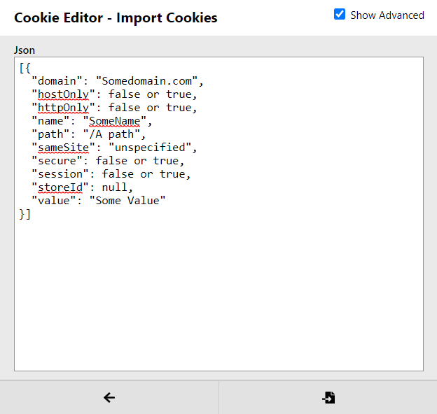

# Cookie-Stealer
A Cookie Stealer for Chrome

Introduction - 
Welcome to a Cookies Stealer for chrome.
What is Cookie Stealing?

Cookie Stealing gets the SESSION data or cookie information such as login details of any unsuspecting victim.

Instructions - 
1. Make Sure have a domain server or simply a subdomain with ssl
2. On the client side change the posturl variable in background.js to the desired domain or subdomain you will be using
3. Drag extension or upload to google extensions
4. Test on yourself or victim and watch the cookies flow in

Ok what now?

- So you may asking yourself I got the cookies but how do I use it.
- To use the cookies you will need an extension called cookie-editor
Cookie Editor Link https://chrome.google.com/webstore/detail/cookie-editor/hlkenndednhfkekhgcdicdfddnkalmdm?hl=en-US

Now you need to put it in the json part of the extension:

The Following Format for the json should look like this:
```
[{
  "domain": "Somedomain.com",
  "hostOnly": false or true,
  "httpOnly": false or true,
  "name": "SomeName",
  "path": "/A path",
  "sameSite": "unspecified",
  "secure": false or true,
  "session": false or true,
  "storeId": null,
  "value": "Some Value"
}]
```

Just Plug in into this format and there you go you got sessions of logins of website with just stealing cookies

